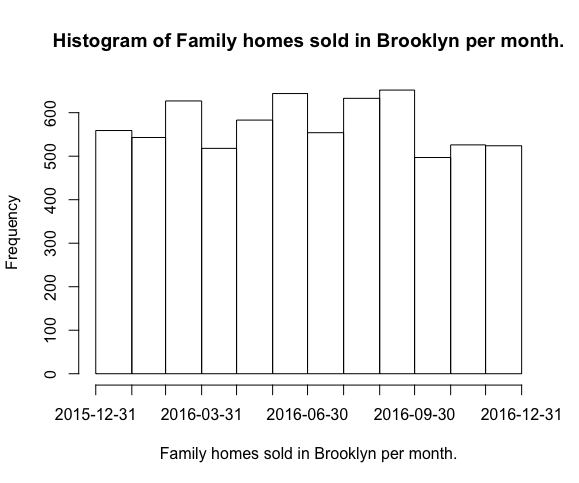

There are 24630 entries in the dataset with a median sale price of $705,200.
There are 6860 records with 1-, 2-, and 3-family homes and a median price of $790,000.
The average price per square feet of the family homes is $457.

The housing market seems to have a consistent volume throughout the year as seen on the histogram.

